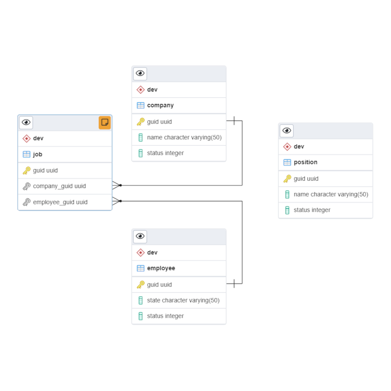
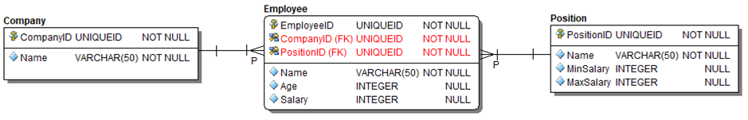

```{r setup, include=FALSE}
library(here)

knitr::opts_chunk$set(echo = FALSE, include = TRUE, results = "hold", message = FALSE)
```

<style type="text/css">

pre code, pre, code {
  white-space: pre !important;
  overflow-x: scroll !important;
  word-break: keep-all !important;
  word-wrap: initial !important;
}


#DocHeader {
margin: 5em 0 1em 0;
solid thick black;
box-shadow: 5px 5px 10px black;
font-size: 1.25em;
width: 100%;
}

#DocHeader > tbody > tr > td {
padding: 0.5em;
border: solid thin black;
}

#DocHeader > tbody > tr > td:first-child {
font-weight: bold;
text-transform: uppercase;
font-size: 1.25em;
max-width: 30%;
}
</style>

<table id="DocHeader">
<tbody>
<tr>
<td>Title</td>
<td>Paylocity Coding Challenge: Challenge Overview</td>
</tr>
<tr>
<td>Author</td>
<td>Eric Milgram, PhD</td>
</tr>
<tr>
<td>Github Permalink</td>
<td>
<a href="https://github.com/ScientificProgrammer/PaylocityCodingChallenge">
ScientificProgrammer/PaylocityCodingChallenge
</a>
</td>
</tr>
<tr>
<td>Document Creation Date</td>
<td>December 15, 2021<sup>1</sup></td>
</tr>
</tbody>
</table>

::: {style="font-size: 1em;"}
<sup>1</sup>Last updated on `r Sys.time()`
:::

------------------------------------------------------------------------

<!---
::: {style="font-size: 1.25em; color: gray;"}
This coding challenge will be part of the interview for Paylocity.
:::
--->

<blockquote style="font-size: 1.75em; background-color: lightgray; box-shadow: 5px 5px 10px black; margin: 2em auto 2em auto; padding: 1.5em; border-radius: 1em; text-align; center;">

A written summary of the candidate's work from these coding challenges must be submitted to Paylocity at least 24 hours prior to the candidate's interview.

</blockquote>

------------------------------------------------------------------------

<!--- ********************** PART 1: CODING CHALLENGE OVERVIEW ********************** --->

# PAYLOCITY CODING CHALLENGE OVERVIEW

## PYTHON EXERCISE

Each candidate is required to complete the following exercise and return it a minimum of 24 hours before their interview. They will be asked to share their ideas with the team during the interview. They should be prepared to walk the team through concepts such as the following.

1.  &ldquo;*Here is a summary of the work that I performed.*&rdquo;

2.  &ldquo;*How did I accomplish the task?*&rdquo;

3.  &ldquo;*Why did I choose a particular approach?*&rdquo;

Also be prepared for a few questions from the team such as, &ldquo;*What would you do if 'this issue' came up?*&rdquo;

The team wants to get an idea how the person thinks. Also, the submitted/developed code should run.

The expectation is that the candidate will complete the `Python` exercise ahead of time and walk through their answer during the **Technical Interview**. The candidate will be expected to present their code and show it running on their machine.

## MULTI-PART SQL EXERCISE: LIVE WALK-THROUGH

The following figure shows an *entity relationship diagram* (ERD) for a conceptual
data model containing the following four tables.

1. Company

1. Position

1. Employee

1. Job

{style="box-shadow: 5px 5px 10px black; border-radius: 15%; margin-bottom: 2em;"}


```{r TableSet1, eval = FALSE}
library(kableExtra)
library(purrr)

dbTables <- vector("list", length = 4)

names(dbTables) <- c("Company", "Position", "Employee", "Job")
  
dbTables[["Company"]] <- data.frame(Company = c("guid", "name", "status"))

dbTables[["Position"]] <- data.frame(Position = c("guid", "name", "status"))

dbTables[["Employee"]] <- data.frame(Employee = c("guid", "state", "status"))

dbTables[["Job"]] <- data.frame(Job = c("guid", "company_guid", "position_guid", "employee_guid"))

htmlTables <- dbTables %>%
  map(function(tbl) {
    tbl %>%  kableExtra::kable()  %>%
      row_spec(0, font_size = 20, color = "white", background = "gray") %>%
       column_spec(1, width = "15em")  %>%
      kableExtra::kable_styling(
        bootstrap_options = c("bordered", "striped", "hover", "condensed", "responsive"),
        full_width = FALSE
      )
  })

knitr::raw_html("<div style='float: left; margin: 0 1em 0 1em;'>\n")
knitr::raw_html(htmlTables[["Company"]])
knitr::raw_html("\n</div>\n")

knitr::raw_html("<div style='float: left; margin: 0 1em 0 1em;'>\n")
knitr::raw_html(htmlTables[["Position"]])
knitr::raw_html("\n</div>\n")

knitr::raw_html("<div style='float: left; margin-right: 1em;'>\n")
knitr::raw_html(htmlTables[["Employee"]])
knitr::raw_html("\n</div>\n")

knitr::raw_html("<div style='float: left; margin: 0 1em 0 1em;'>\n")
knitr::raw_html(htmlTables[["Job"]])
knitr::raw_html("\n</div>\n")

```

:::{style="clear: both;"}
The expectation is that the candidate is able to write SQL live while using whatever tool they have access to, as well as asking questions of the team. For our data needs, we will be either retrieving or inserting additional data into our physical database schema that is based on the data model described here. All of the following actions will be performed on the physical database schema.
:::

**ACTIONS**

-   INSERT
-   UPDATE
-   DELETE

A `timestamp` will be inserted or updated with various records in each of the tables in our database.

---

<!--- ********************** PART 2: CODING CHALLENGE DETAILS ********************** --->

# CODING CHALLENGE DETAILS

## WRITE A PYTHON SCRIPT

You're tasked with writing a Python script, which must do the following items.

1.  Read in a file that contains multiple lines.

    1.  Each line will be a JSON formatted record (which may be from any of the models above).

    2.  You will be able to differentiate which table to use by reading an extra column inside each record called `source_table`.

    3.  This state information can be found using `source_table`, `guid`, `action`, and `timestamp`.

2.  Print out the final state of each record (after all actions have been applied).

**NOTE**: You are free to add additional columns to your models as you see fit for the purpose of testing your application.

A sample input file is provided for you. It can be downloaded directly from the [data subdirectory](./data/010_Paylocity_sample_payload_for_DB_loading.txt) of this repo, and it is also available in the Appendix &lpar;see [below](#31-sample-input-database-payload-file)&rpar;. When processing this file, your code should print an output similar to what is shown here.

------------------------------------------------------------------------

    Company
    ==========
    {'guid': '1c898066-858e-406c-a15d-36146c9642de', 'name': 'Paylocity', 'status': '2'}
    {'guid': '0090d7b0-b07a-47cd-b295-ff798a6c0613', 'name': 'Burrito Shack', 'status': '2'}
    
------------------------------------------------------------------------    

    Position
    ==========
    {'guid': '40a36493-f450-4331-874c-5ef01aabe1d5', 'name': 'Software Engineer', 'status': '1'}
    {'guid': 'f9b3ee71-7fb2-4dd5-9c13-b4c10d11fde7', 'name': 'Data Engineer',     'status': '1'}

------------------------------------------------------------------------

    Employee
    ==========
    {'guid': 'e086115c-0ca1-480c-8fa8-5e1773558b9f', 'state': 'FL', 'status': '2'}
    {'guid': '4e0c8c17-b031-4a72-b73d-f0a85570826d', 'state': 'MI', 'status': '3'}
    {'guid': 'd4926109-b6c9-4447-a53c-b787684e10f1', 'state': 'IL', 'status': '3'}
    {'guid': '259d5154-5f76-481b-b0f9-53e24c3b570e', 'state': 'NY', 'status': '1'}

------------------------------------------------------------------------

    Job
    ==========
    {'guid': '58291fe5-4e4c-41da-87a5-e1fccb8aac25', 'company_guid': '1c898066-858e-406c-a15d-36146c9642de', 'employee_guid': 'e086115c-0ca1-480c-8fa8-5e1773558b9f'}
    {'guid': 'f73a2796-4579-4779-8345-f0dfcf7dd533', 'company_guid': '0090d7b0-b07a-47cd-b295-ff798a6c0613', 'employee_guid': '4e0c8c17-b031-4a72-b73d-f0a85570826d'}
    {'guid': '5ab54bb5-b72d-40f8-9a49-e0d2d004d7a9', 'company_guid': '0090d7b0-b07a-47cd-b295-ff798a6c0613', 'employee_guid': '259d5154-5f76-481b-b0f9-53e24c3b570e'}

------------------------------------------------------------------------

Your code will be evaluated on the following elements, which will also form the basis for our questions.

1.  Algorithm
2.  Print Management
3.  Code Abstraction
4.  Documentation
5.  Testing

<blockquote style="font-size: 1.75em; background-color: lightgray; box-shadow: 5px 5px 10px black; margin: 2em auto 2em auto; padding: 1.5em; border-radius: 1em; text-align; center;">

This is your chance to show us what you can do! Have fun with the exercise!

</blockquote>

## SQL EXERCISE

[Figure 1](#fig-container-erd-company-employee-position), which is shown below, illustrates an *entity relationship diagram* (ERD) for a logical
data model consisting of three tables named *Company*, *Employee*, and
*Position*. The ERD represented in **Figure 1** also contains the following
informational elements, which are important for constructing a physical data model.

1. *Field names* for each table

1. *Data types* for each field

1. *Field constraints*, including *primary keys* and *foreign keys*

1. *Foreign key relationships* between *tables*, including *directionality*, *cardinality*, and *optionality*


```{r TableSet2, eval = FALSE}
library(kableExtra)
library(purrr)

dbTables2 <- vector("list", length = 0)

dbTables2[["Company"]] <- data.frame(Company = c("guid", "name"))

dbTables2[["Position"]] <- data.frame(Position = c("guid", "name", "min_salary", "max_salary"))

dbTables2[["Employee"]] <- data.frame(Employee = c("guid", "name", "age", "Salary", "company_guid", "position_guid"))

htmlTables <- dbTables2 %>%
  purrr::map(function(tbl) {
    
    tbl %>%  kableExtra::kable()  %>%
      kableExtra::row_spec(0, font_size = 20, color = "white", background = "gray") %>%
       kableExtra::column_spec(1, width = "15em")  %>%
      kableExtra::kable_styling(
        bootstrap_options = c("bordered", "striped", "hover", "condensed", "responsive"),
        full_width = FALSE,
        position = "left"
      )
  })

knitr::raw_html("<div style='float: left; margin-right: 1em;'>\n")
knitr::raw_html(htmlTables[['Company']])
knitr::raw_html("\n</div>\n")

knitr::raw_html("<div style='float: left; margin: 0 1em 0 1em;'>\n")
knitr::raw_html(htmlTables[['Employee']])
knitr::raw_html("\n</div>\n")

knitr::raw_html("<div style='float: left; margin-left: 1em;'>\n")
knitr::raw_html(htmlTables[['Position']])
knitr::raw_html("\n</div>\n")

```
:::{id="fig-container-erd-company-employee-position" style="margin: 2em auto 2em auto; padding: 2em; border: solid thin black; border-radius: 2em; box-shadow: 3px 3px 5px black;"}

:::


For the data model illustrated in **Figure 1**, please complete the following actions.


1.  Write a SQL query to generate a result set for a report that contains the average salary for all employees.

1.  Update the previous query to generate a result set showing the average salary for all employees within each company.

1. Let's assume your previous query was long running. Please describe the process you would use to find the root causes of the query's sluggishness?

---

# APPENDICES

## Sample Input Database Payload File{id='sample_input_payload_data'}

NOTE: Although the full contents of the sample payload file are shown
below, you can also download the file from the [data subdirectory](./data/010_Paylocity_sample_payload_for_DB_loading.txt)  of this repo.

Alternatively, you can also download this file directly using `curl` or `wget` via the [raw link](https://raw.githubusercontent.com/ScientificProgrammer/PaylocityCodingChallenge/master/data/010_Paylocity_sample_payload_for_DB_loading.txt). See the code in the next section for an example.

### Bash Shell Code to Download the Payload Data File

    BASE_URL="raw.githubusercontent.com/ScientificProgrammer/PaylocityCodingChallenge"
    FILE_NAME="010_Paylocity_sample_payload_for_DB_loading.txt"
    
    curl -i -SL "https://${BASE_URL}/master/data/${FILE_NAME}" -o ${FILE_NAME}
    
---

### Full Data Set


```{r ShowPayloadFile}
library(readr)
library(here)

sampleText <- readr::read_lines(here::here("./data/010_Paylocity_sample_payload_for_DB_loading.txt"))
knitr::asis_output(paste0("     ", sampleText, "\n"))
```


::: {style="height: 5em;"}
:::
