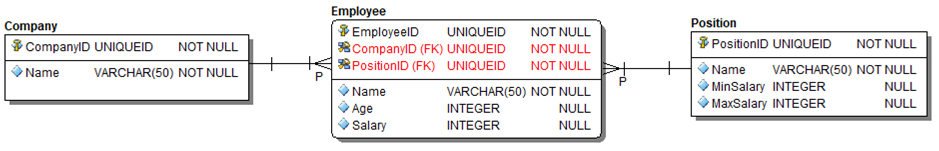

```{r setup, include=FALSE}
knitr::opts_chunk$set(echo = FALSE, include = TRUE, results = "hold", message = FALSE)
```

```{css, echo = FALSE}

pre {
  max-height: 800px !important;
  overflow-y: auto !important;
  overflow-x: scroll !important;
}
pre code {
  white-space: pre
}

```

# Paylocity Coding Challenge: Problem 2 of 2

<div style="font-size: 1.5em; padding-bottom: 0;">Eric Milgram, PhD</div>
<table>
<tbody>
<tr>
  <td style="padding: 0; display: none;">
    <a href="https://github.com/ScientificProgrammer/PaylocityCodingChallenge">ScientificProgrammer/PaylocityCodingChallenge</a>
  </td>
</tr>
<tr>
  <td style="padding: 0;">
    Created: December 21, 2021
  </td>
</tr>
<tr>
  <td style="padding: 0;">
    Last Updated: `r Sys.time()`</span>
  </td>
</tr>
</tbody>
</table>


##  SQL Exercise - Live Walkthrough

[Figure 1](#fig-container-erd-company-employee-position), which is shown below,
illustrates an *entity relationship diagram* (ERD) for a logical data model
consisting of three tables named *Company*, *Employee*, and *Position*. The ERD
represented in **Figure 1** also contains the following informational elements,
which are important for constructing a physical data model.

1.  *Field names* for each table

1.  *Data types* for each field

1.  *Field constraints*, including *primary keys* and *foreign keys*

1.  *Foreign key relationships* between *tables*, including *directionality*,  
    *cardinality*, and *optionality*


``` {r TableSet2, eval = FALSE}
library(kableExtra)
library(purrr)


dbTables2 <- vector("list", length = 0)

dbTables2[["Company"]] <- data.frame(Company = c("guid", "name"))

dbTables2[["Position"]] <- data.frame(Position = c("guid", "name", "min_salary", "max_salary"))

dbTables2[["Employee"]] \<- data.frame(Employee = c("guid", "name", "age",
"Salary", "company_guid", "position_guid"))

htmlTables \<- dbTables2 %\>% purrr::map(function(tbl) {
    
    tbl %>%  kableExtra::kable()  %>%
      kableExtra::row_spec(0, font_size = 20, color = "white", background = "gray") %>%
       kableExtra::column_spec(1, width = "15em")  %>%
      kableExtra::kable_styling(
        bootstrap_options = c("bordered", "striped", "hover", "condensed", "responsive"),
        full_width = FALSE,
        position = "left"
      )

})

knitr::raw_html("<div style='float: left; margin-right: 1em;'>\n")
knitr::raw_html(htmlTables[['Company']]) knitr::raw_html("\n</div>\n")

knitr::raw_html("<div style='float: left; margin: 0 1em 0 1em;'>\n")
knitr::raw_html(htmlTables[['Employee']]) knitr::raw_html("\n</div>\n")

knitr::raw_html("<div style='float: left; margin-left: 1em;'>\n")
knitr::raw_html(htmlTables[['Position']]) knitr::raw_html("\n</div>\n")
```

:::{id="fig-container-erd-company-employee-position" style="margin: 2em auto 2em auto; padding: 2em; border: solid thin black; border-radius: 2em; box-shadow: 3px 3px 5px black;"}

:::

### For the data model illustrated in **Figure 1**, please complete the following actions.

1.  Write a SQL query to generate a result set for a report that contains the  
    average salary for all employees.

1.  Update the previous query to generate a result set showing the average  
    salary for all employees within each company.

1.  Let&apos;s assume your previous query was long running. Please describe the  
    process you would use to find the root causes of the query&apos;s sluggishness?

::: {style="height: 10em;"}
:::
